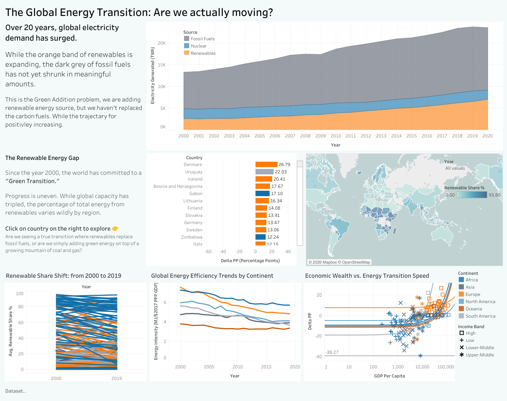

# Project 2 — Global Sustainable Energy Interactive Dashboard

**Due:** 31 May 2026 23:59 | **Task:** Interactive dashboard (5–8 visualisations) + design report (1000–1250 words) + data cleaning report

**Theme:** The Global Energy Transition — *"Are we actually moving?"*

**Live dashboard:** [View on Tableau Public](https://public.tableau.com/views/Sustainable-energy-clean/Dashboard1)



## Required Tools

- Python 3.8+
- pandas and openpyxl (`pip install pandas openpyxl`) — openpyxl is needed for the `.xlsx` outputs
- Tableau Public (free account at <https://public.tableau.com>)

## Files in this Folder

| File | Type | Description |
|---|---|---|
| `global-data-on-sustainable-energy.csv` | Input (raw) | 3,649 rows × 21 columns; 176 countries × years 2000–2020 |
| `continent-mapping.csv` | Input (lookup) | Country → Continent (six continents, hand-curated) |
| `clean_energy_data.py` | Script | The cleaning pipeline |
| `sustainable-energy-clean.csv` | **Output** | Main cleaned dataset, one row per country-year, renamed columns + derived fields |
| `global-mix-by-year.csv` | **Output** | Pre-aggregated electricity mix (TWh) per year, long form — used by the stacked area chart |
| `renewable-share-delta.csv` | **Output** | One row per country: renewable share 2000 vs 2019 + delta — used by slope chart and bar chart |

## Running the Script

From the `project_2/` directory:

```bash
pip install pandas openpyxl   # first time only
python clean_energy_data.py
```

This reads `global-data-on-sustainable-energy.csv` and `continent-mapping.csv` and
overwrites the three output files (`.csv` + `.xlsx`) in place.

### Expected Output

```text
Loaded 3,649 rows, 176 countries, 2000-2020
Wrote sustainable-energy-clean.csv (3,649 rows)
Wrote global-mix-by-year.csv (63 rows)
Wrote renewable-share-delta.csv (171 countries)

Top 5 risers in renewable share (percentage points):
               Country     Continent  RenewableShare2000  RenewableShare2019  DeltaPP
               Denmark        Europe               10.73               37.52    26.79
               Uruguay South America               38.73               60.76    22.03
               Iceland        Europe               60.66               81.07    20.41
Bosnia and Herzegovina        Europe               19.35               37.02    17.67
                 Gabon        Africa               72.78               89.88    17.10
```

## What the Script Does

1. **Renames columns** — raw columns have spaces, units, and even a literal `\n` in the density column header. Renamed to compact identifiers (e.g. `Renewable energy share in the total final energy consumption (%)` → `RenewableSharePct`) so Tableau pills stay tidy.
2. **Fixes density column** — `DensityPerKm2` arrives as strings with comma thousand-separators (e.g. `"2,239"`); commas stripped and column coerced to numeric.
3. **Reconstructs Population** — the raw dataset has no population column; computed as `DensityPerKm2 × LandAreaKm2` so per-capita metrics can be derived.
4. **Attaches Continent** — looked up via `continent-mapping.csv`. The script fails loudly if any country is unmapped, so updating the dataset means updating the lookup.
5. **Derives IncomeBand** — bins `GDPPerCapita` into World Bank-style brackets (Low / Lower-Middle / Upper-Middle / High) so the dashboard can filter by income group.
6. **Builds the global energy mix** — sums electricity TWh by source (fossil / nuclear / renewables) per year and emits long-form data ready for a stacked area chart.
7. **Builds the renewable-share delta** — pivots the data to compare each country's renewable share in 2000 vs 2019 and computes the delta in percentage points, used by the slope chart and "fastest movers" bar chart.

## Data Quality Notes

- **2019 vs 2020 cutoff:** `RenewableSharePct`, `LowCarbonElectricityPct`, `EnergyIntensity`, and most other percent-based columns are populated up to 2019 only — the 2020 value is missing for all but one country. All before/after comparisons therefore use **2000 → 2019**, not 2000 → 2020. The TWh-based electricity columns extend through 2020 and so the stacked area chart and the map use the full range.
- **Financial flows** has only ~43% coverage (zero/blank for most developed countries) — exclude developed-country rows when using this column.
- **Renewables (% equivalent primary energy)** has only ~41% coverage and is not used in this dashboard.
- **GDP per capita** is missing for ~8% of country-years; these rows will have a blank `IncomeBand`.

## Tableau Import

Connect Tableau to all three output files as separate data sources:

- **sustainable-energy-clean.csv** — primary source for the map, slope chart, multi-line, scatter
- **global-mix-by-year.csv** — sole source for the stacked area chart
- **renewable-share-delta.csv** — sole source for the bar chart and slope chart

After connecting, verify:

- `Continent` has exactly 6 distinct values
- `IncomeBand` has 4 distinct values (Low, Lower-Middle, Upper-Middle, High) plus blanks
- `Year` ranges 2000–2020 in the main file
